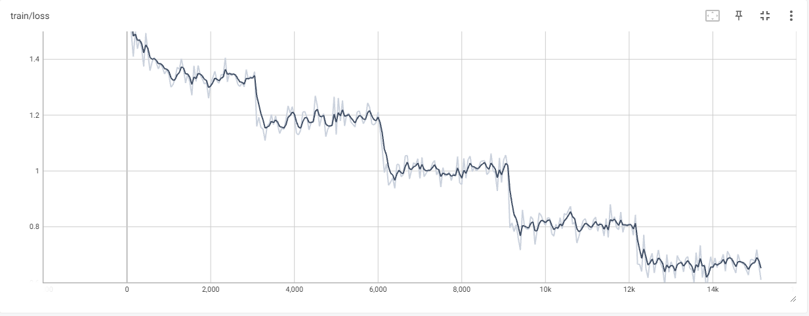

<p align="center" width="100%">

</p>

## Update Logs
- 2023.08.19: [🤗ko_medical_chat](https://huggingface.co/datasets/squarelike/ko_medical_chat) 의료 대화 데이터셋을 공개합니다.
- 2023.08.19: 한국어 의료 대화 데이터가 학습된 [🤗polyglot-ko-medical-chat-5.8b](https://huggingface.co/squarelike/polyglot-ko-medical-chat-5.8b)를 공개합니다.(QLoRA로 학습, 병합모델)
- 2023.08.19: [polyglot-ko-medical-chat-5.8b 학습 코드](https://github.com/jwj7140/ko-medical-chat/blob/main/polyglot_medical_learn.ipynb)를 공개합니다.
- 2023.08.15: 의료 특화 기반모델인 [🤗squarelike/polyglot-ko-medical-5.8b](https://huggingface.co/squarelike/polyglot-ko-medical-5.8b)를 공개합니다.(QLoRA로 학습, 병합모델)

# ko-medical-chat

[Polyglot-ko](https://huggingface.co/EleutherAI/polyglot-ko-1.3b)를 기반으로 만들어진 의료 특화 한국어 대화형 언어모델 입니다.

## 직접 해보기

```
python app.py
```
webUI를 통해 모델을 사용할 수 있습니다.

## 프롬프트

```
아래는 매우 전문적인 의사와 환자의 진료 기록이다.

환자: {question}
의사:
```

## polyglot-ko-medical-chat-5.8b

### 데이터셋

[squarelike/ko_medical_chat](https://huggingface.co/datasets/squarelike/ko_medical_chat)

### 학습

QLoRA를 사용해 RTX3060ti 8GB 1대로 학습을 진행했습니다. 학습 코드는 [polyglot_medical_learn.ipynb](https://github.com/jwj7140/ko-medical-chat/blob/main/polyglot_medical_learn.ipynb)를 참고하세요
- Epoch: 5
- learning-rate: 3e-4
- batch_size: 1
- Lora r: 8
- Lora target modules: query_key_value

사용자가 입력하는 부분에 마스킹 처리를 했습니다.



## 데이터셋 제작과정

[MedText](https://huggingface.co/datasets/BI55/MedText)와 [ChatDoctor](https://github.com/Kent0n-Li/ChatDoctor) 데이터셋을 GPT3.5를 통해 한국어 대화로 변환시켰습니다.

gpt3.5에서 사용한 프롬프트는 다음과 같습니다.
```
환자: {환자의 정보 및 증상}

의사: {의사의 진단}

Transform the Q&A above into a conversation between a patient and a doctor in short sentences. Please refer to the following conditions when converting.

1. Write in korean
2. The doctor asks various questions to get more information from the patient's speech.
3. The patient answers the doctor's questions truthfully.
4. Each conversation consists of only one sentence.
5. The doctor tells the conclusion he thinks.
6. After the doctor's conclusion, the patient asks how to cope.
7. The doctor initially knows nothing about the patient and his test results, and gets the information from the patient's words.

Write a dialogue by referring to the conditions above and the Q&A.
```
gpt3.5 응답 예시:
```
환자: 안녕하세요, 의사님.\n의사: 안녕하세요. 어떤 증상으로 오셨나요?
환자: 저는 두통과 어지러움이 자주 옵니다.
의사: 언제부터 이런 증상이 있나요?
환자: 이번 주부터 느껴지기 시작했어요.
의사: 그럼 일어나거나 움직일 때 증상이 더 심해지나요?
환자: 네, 그렇습니다. 특히 일어날 때 어지러움이 심해져요.
의사: 혹시 메스꺼움이나 구토 같은 증상도 있나요?
환자: 아니요, 그런 증상은 없어요.
의사: 알겠습니다. 제 생각에는 이런 증상들은 어떤 미생물이나 바이러스로 인한 것일 수 있습니다. 추가적인 검사를 해보는 것이 좋을 것 같습니다.
환자: 그렇다면 어떻게 대처해야 하나요?
의사: 우선은 휴식을 취하고, 물을 충분히 섭취하시고, 밝은 환경에서 휴식을 취하시는 것이 좋습니다. 또한, 추가적인 검사를 통해 원인을 파악하고 치료 방법을 결정할 수 있을 것입니다.
환자: 알겠습니다. 검사를 받아보고 싶습니다. 어떤 검사를 받아야 하나요?
의사: 먼저 혈액 검사를 통해 일반적인 건강 상태를 확인하고, 필요에 따라 뇌파 검사나 내시경 검사 등을 고려해볼 수 있습니다. 추가적인 검사 결과를 통해 정확한 진단과 치료 방법을 찾을 수 있을 것입니다.
환자: 감사합니다. 검사를 받아보도록 하겠습니다.
```

이를 통해 약 3000개 정도의 대화로 이루어진 [ko_medical_chat](https://huggingface.co/datasets/squarelike/ko_medical_chat)데이터셋을 제작했습니다.


## 한계점

본 프로젝트의 언어모델은 의료적인 전문성을 가지지 않습니다. 실제 증상이 있을 경우 반드시 의사와 상담하시길 바랍니다.

## TO DO LIST

- 데이터셋 규모 키우기
- RLHF 강화학습 진행
